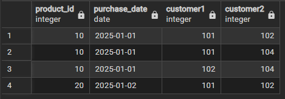
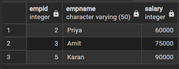

## DBMS Practical MST 
### Odd Set
### Question 1 
``` sql
-- Creating the table

CREATE TABLE Purchases(
    purchase_id INT PRIMARY KEY,
    customer_id INT,
    product_id INT,
    purchase_date DATE );

-- Inserting the values

INSERT INTO Purchases VALUES

(1, 101, 10, '2025-01-01'),

(2, 102, 10, '2025-01-01'),

(3, 103, 20, '2025-01-01'),

(4, 104, 10, '2025-01-01'),

(5, 101, 20, '2025-01-02'),

(6, 102, 20, '2025-01-02');

-- Main Query

SELECT 
    p1.customer_id AS CustomerA,
    p2.customer_id AS CustomerB,
    p1.product_id,
    p1.purchase_date
FROM Purchases p1
JOIN Purchases p2
ON p1.product_id = p2.product_id
AND p1.purchase_date = p2.purchase_date
AND p1.customer_id < p2.customer_id;
```
### Output:



### Question 2
```sql
-- Creating Table

CREATE TABLE Employee(
    EmpID INT PRIMARY KEY,
    EmpName VARCHAR(50),
    Salary INT );

-- Inserting Values

INSERT INTO Employee VALUES
(1, 'Rahul', 45000),
(2, 'Priya', 60000),
(3, 'Amit', 75000),
(4, 'Neha', 30000),
(5, 'Karan', 90000);

-- Main Query

CREATE VIEW HighSalaryEmployees AS
SELECT EmpID, EmpName, Salary
FROM Employee
WHERE Salary > 50000;

SELECT * FROM HighSalaryEmployees;
```
### Output:




